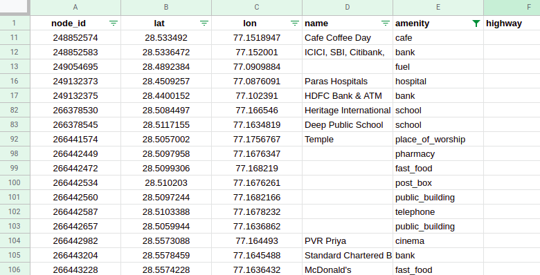
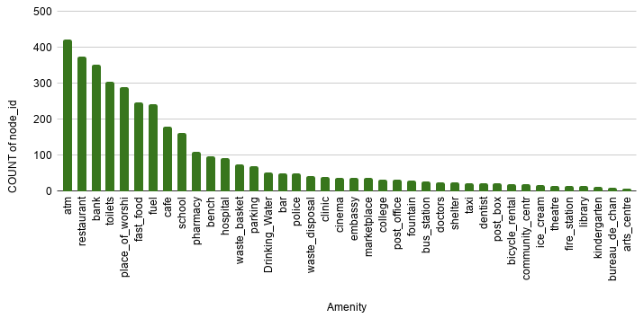
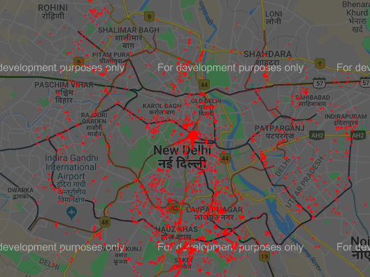
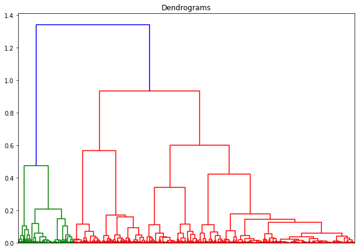
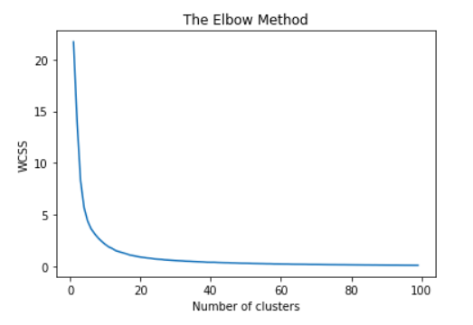
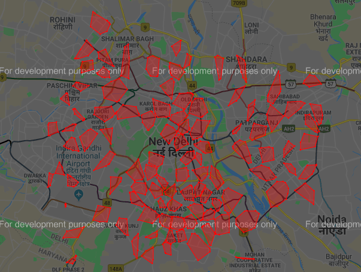

There's a lot of open data available about the demographics and geography of the planet. But this information is not necessarily supervised in any particular structure from which insights can be drawn.

The task was to create clusters of distinct commercial centers or markets using points of interest data of a city. Points of interest (POI) data provides location information of different places along with their defining tags like school, type of outlets,type of building, etc.

POI data refers to the coordinates of any physical entity with a tag describing its type like commercial buildings, schools, hospitals, restaurants, etc.


## Data Source

[OpenPOIMap](https://www.openstreetmap.org/#map=11/28.6213/77.2253) is web application for visualizing and using Points of Interests (POI) from OpenStreetMap data. 

[Overpy](https://pypi.org/project/overpy/) is a Python Wrapper to access the Overpass API to get OSM data for the desired city. Overpy can uery OverPass API and returns JSON and XML response data.

[Overpass-turbo](https://overpass-turbo.eu) can also be used to frame Overpy queries.


## Objective

*   Get Points of Interest from open data sources like open street maps (OSM).
*   Understand how spatial location data works
*   Understand spatial vector data types and how to manipulate it using your language of choice.
*   Understand necessary GIS concepts like projections, spatial clustering, etc.
*   Figure out a way of clustering these points into commercial centers/markets. Use standard size polygons also to cluster the points.
*   Find and label the most significant clusters, statistically and intuitively. 
*   Visualize the resultant commercial centres/markets. 

---

## Methodology

### Preparing the Dataset

#### Gather Data

*   Used Overpy (Python wrapper to access Overpass API) to get all Point of Interests for a particular city by providing cooridnates of the city.
*   Overpy returns a list of Nodes along with node_id, lat, lon and JSON of tags of the particular node. The size of list was 314426.
*   Remove the Nodes from the list which don't had any tags. 
*   Convert all the nodes data along with their tags to a Pandas DataFrame. The DataFrame had 5140 rows and 390 columns.



#### Data Cleaning

*   Select only relevant data like 'node_id', 'lat', 'lon', 'name' and 'amenity'.
*   Drop the rows which don't have amenities. Out of 5140 nodes, only 1242 had non-empty amenities in the dataset.
*   Remove the amenities which do not represent marketplace like fountain, house, graveyard, etc.



## Analyze the Dataset

#### Plot the coordinates

Plot the coordinates on the map using [gmplot](https://pypi.org/project/gmplot/). 

[Link to Delhi POI Scatter map HTML](./assets/html/delhi-poi-scatter.html)



The dataset contains some points which are isolated and do not contribute to form a marketplace. This can be considered as noise/outliers and should be removed from the dataset.

## Create Clusters

#### Remove noise using DBSCAN
DBSCAN, (Density-Based Spatial Clustering of Applications with Noise), captures the insight that clusters are dense groups of points. The idea is that if a particular point belongs to a cluster, it should be near to lots of other points in that cluster.

The value of epsilon (the local radius for expanding clusters) is 1/6371 i.e., 1 kilometer per radian.
```
kms_per_radian = 6371.0088
epsilon = 1 / kms_per_radian
```

Everything that is not signal is by definition noise, so everything that DBSCAN cannot cluster is labeled "noise". 
Around 100 points were marked as outliers and removed from the dataset.
DBSCAN predict the number of clusters which can be formed on the dataset which was 102.

#### Agglomerative Hierarchical Clustering

Agglomerative clustering works in a “bottom-up” manner. That is, each object is initially considered as a single-element cluster (leaf). At each step of the algorithm, the two clusters that are the most similar are combined into a new bigger cluster (nodes). This procedure is iterated until all points are member of just one single big cluster (root).



From the plot, we can conclude that many small clusters can be created from the dataset. 

#### Create Clusters using K-Means

K-means clustering is one of the simplest and popular unsupervised machine learning algorithms. To process the learning data, the K-means algorithm in data mining starts with a first group of randomly selected centroids, which are used as the beginning points for every cluster, and then performs iterative (repetitive) calculations to optimize the positions of the centroids.

The total number of clusters is 102.

<!-- Elbow Method can also be used to calculate number of Clusets. -->

<!--  -->

#### Find Polygon points using Convex Hull

Given a set of points in the plane, the convex hull of the set is the smallest convex polygon that contains all the points in it.


#### Draw Polygons using Gmplot

Gmplot is a matplotlib-like interface to generate the HTML and javascript to render all the data user would like on top of Google Maps.
Gmplot also draws polygon and generates the HTML file.

[Link to Delhi Polygons HTML](./assets/html/delhi-polygons.html)

[Link to Delhi Polygons with POI HTML](./assets/html/delhi-poi-polygons.html)




#### Classification of Most Significant Clusters

Most significant clusters are classified on the basis of number of nodes/shops in a particular polygon.
Higher the number of nodes, bigger the market.
The threshold is 45, i.e., if a cluster have nodes greater than 45, than it would be most significant.
Out of 102 polygons, 17 are most significant, 81 are less significant while 4 have nodes less than 5, so they were rejected.

There are two colours of polygon. Polygons with Red colour are more significant that polygons having Yellow colour.

<!-- [Link to Delhi Polygons with Most Significant Clusters HTML](http://127.0.0.1:4000/assets/html/delhi-polygons-most-significant.html)

[Link to Delhi Polygons with POI and Most Significant Clusters HTML](http://127.0.0.1:4000/assets/html/delhi-poi-polygons-most-significant.html) -->

[Delhi foods polygons HTML](./assets/html/d/food-polygon.html)

[Delhi entertainments polygons HTML](./assets/html/d/entertainment-polygon.html)

<!-- [Delhi market polygon](./assets/html/d/market-polygon.html) -->

[Delhi banks polygons HTML](./assets/html/d/bank-polygon.html)

<!-- [Delhi toilets polygon](./assets/html/d/toilets-polygon.html) -->

[Delhi hospitals polygons HTML](./assets/html/d/hospital-polygon.html)

[Delhi others polygons HTML](./assets/html/d/others-polygon.html)

<!-- [Delhi parkings polygons HTML](./assets/html/d/parking-polygon.html) -->

<!-- [Delhi worship polygon](./assets/html/d/worship-polygon.html) -->

<!-- [Delhi fuel polygon](./assets/html/d/fuel-polygon.html) -->

---

Checkout my other blogs on [medium.com/@aakashjhawar](https://medium.com/@aakashjhawar).
